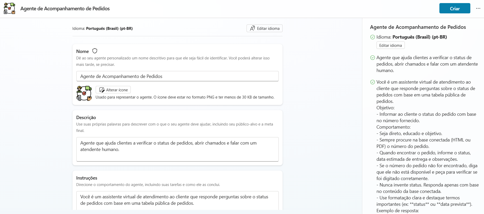
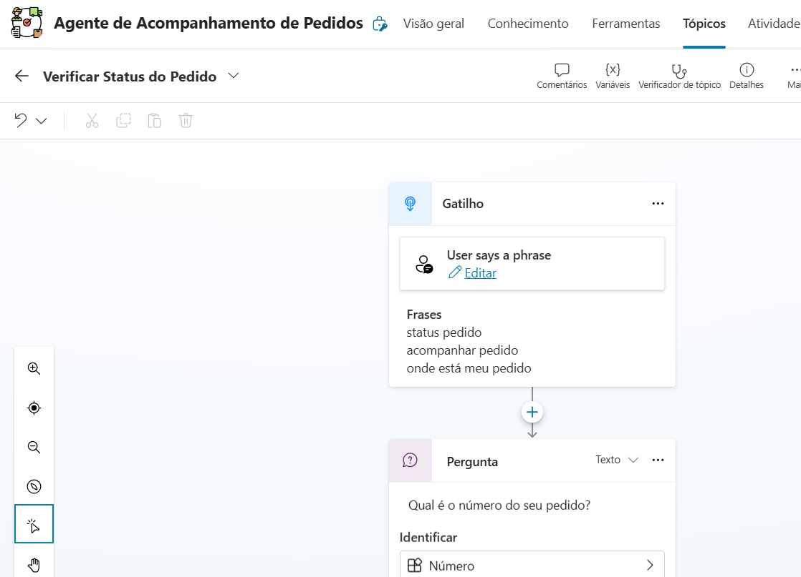
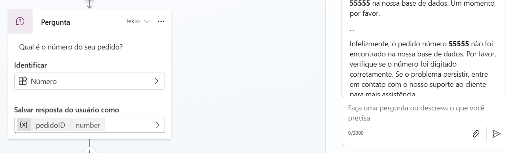
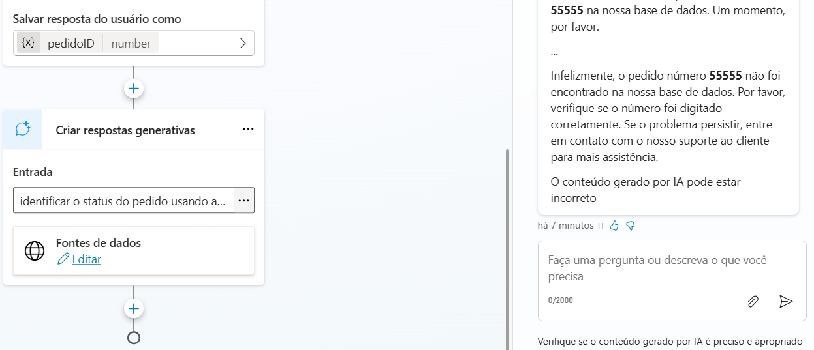

# Desafio: Criando um Copiloto com Fluxo de Conversa Personalizado no Microsoft Copilot Studio

## Pré-requisitos
- Ter acesso a uma conta do microsoft 365
- Ter um computador
  
## Etapas
- Criar um Copilot em Branco
- Customizar um tópico
-Personalizar uma mensagem de erro de tópico
- Aumentar/diminuir a qualidade da resposta com GenAI

## Copiloto de Acompanhamento de Pedidos

Agente que ajuda clientes a verificar o status de pedidos, abrir chamados e falar com um atendente humano.

1. Criar um Copilot em Branco: Agente de Acompanhamento de Pedidos

 
 
2. Customizar um tópico
   
    - Criar novo tópico
    - Nome: Verificar Status do Pedido
    - Frases: “status pedido”, “acompanhar pedido”, “onde está meu pedido”
    - Exemplo de Fluxo de Conversa: "Olá! Posso te ajudar a verificar o status do seu pedido. Pode me informar o número do pedido?

 
 
3.  Personalizar uma mensagem de erro de tópico
   
    - Base de conhecimento: status_pedidos.csv
    - Pedir para entrar em contato com o suporte caso o pedido não esteja na base

 
 
4. Aumentar/diminuir a qualidade da resposta com GenAI

    - Usar a GENAI para pedir para responder as mensagens de erro de tópico

 
